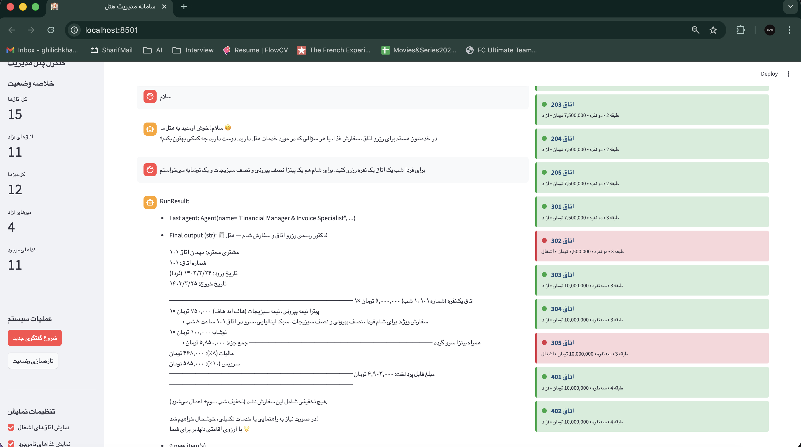

# 🏨 Multi-Agent Hotel Management System

*An advanced AI-powered hotel management system using OpenAI's Agents SDK with bilingual support (Persian/English)*



## 📋 Project Overview

This project implements a sophisticated multi-agent system for comprehensive hotel management, including room reservations, restaurant services, and financial operations. Built with OpenAI's cutting-edge Agents SDK, the system demonstrates advanced AI coordination patterns, natural language processing in multiple languages, and intelligent task routing.

### 🎯 Key Highlights

- **Multi-Agent Architecture**: Specialized agents for different hotel operations
- **Bilingual Support**: Seamless Persian and English language processing
- **Intelligent Orchestration**: Smart routing of complex customer requests
- **Professional UI**: Modern Streamlit web interface with real-time monitoring
- **Advanced Financial Management**: Automated invoicing, tax calculations, and discount applications

## 🏗️ System Architecture

### Core Agents

#### 1. **Orchestrator Agent** 🎯
- **Role**: Central coordinator and primary customer interface
- **Responsibilities**: 
  - Direct response to simple queries
  - Intelligent routing to specialist agents
  - Complex request handling and coordination
- **Intelligence**: Determines whether to respond directly or delegate to specialists

#### 2. **Room Agent** 🏨  
- **Specialization**: Room booking and availability management
- **Capabilities**:
  - Real-time availability checking
  - Room reservations with instant confirmation
  - Multi-type room support (single, double, triple)
  - Floor and pricing information

#### 3. **Restaurant Agent** 🍽️
- **Specialization**: Food services and dining management
- **Advanced Features**:
  - Multilingual food name normalization
  - Customizable menu items with complex options
  - Table reservation coordination
  - Weekly meal program management
  - Persian cuisine specialization

#### 4. **Manager Agent** 💰
- **Specialization**: Financial operations and invoice generation
- **Services**:
  - Professional invoice generation
  - Tax and service charge calculations
  - Intelligent discount application
  - Multi-service cost consolidation

## 🛠️ Technical Features

### Intelligent Tool System

#### Room Management Tools
- **`check_room_availability`**: Real-time room status checking
- **`book_room`**: Instant room reservations with confirmation

#### Restaurant & Dining Tools
- **`get_menu_items`**: Dynamic menu with availability tracking
- **`order_food`**: Complex food ordering with customizations
- **`create_half_taste_pizza_order`**: Specialized pizza customization
- **`reserve_table`**: Table booking for various party sizes
- **`get_meal_of_the_day`**: Weekly meal program integration

#### Financial Management Tools
- **`generate_invoice`**: Professional invoice creation
- **`calculate_receipt_total`**: Comprehensive cost calculations
- **`apply_discount_rules`**: Intelligent discount application

#### Date & Scheduling Tools
- **`get_current_date_info`**: Real-time date processing
- **`calculate_future_date`**: Smart date calculations for reservations

### Database Systems
- **Room Management**: 15 rooms across 4 floors with varied pricing
- **Restaurant Menu**: 12+ items with complex customization options
- **Table System**: 12 tables with different capacities (4-10 people)
- **Reservation Tracking**: Complete booking and order history

## 🚀 Getting Started

### Prerequisites
- Python 3.12+
- OpenAI API key
- Virtual environment (recommended)

### Installation

1. **Clone the repository:**
   ```bash
   git clone <repository-url>
   cd parspack-agentic-ai-task
   ```

2. **Create and activate virtual environment:**
   ```bash
   python -m venv venv
   source venv/bin/activate  # On Windows: venv\Scripts\activate
   ```

3. **Install dependencies:**
   ```bash
   pip install -r requirments.txt
   ```

4. **Configure environment:**
   Create a `.env` file in the root directory:
   ```
   OPENAI_API_KEY=your_openai_api_key_here
   ```

### Running the Application

#### Option 1: Modern Web Interface (Recommended)
```bash
streamlit run app.py
```
Access the application at `http://localhost:8501`

#### Option 2: Command Line Interface
```bash
python main.py
```

## 💻 User Interfaces

### Streamlit Web Application
- **Professional Persian UI** with real-time status monitoring
- **Live system metrics**: Room availability, menu status, table reservations
- **Interactive chat interface** with conversation history
- **Visual status indicators** for all hotel resources
- **Responsive design** optimized for hotel staff

### Command Line Interface
- **Direct agent interaction** through terminal
- **Real-time status displays** for rooms and menu
- **Simple text-based conversations**

## 🌟 Example Usage Scenarios

### Simple Room Booking (Persian)
```
User: "یک اتاق دو نفره برای سه شب می‌خواستم"
System: ✅ Room 203 successfully reserved for 3 nights - Total: 22,500,000 Tomans

```

### Large Group Dining (Persian)
```
User: "۱۰ پرس کباب کوبیده و ۵ پرس جوجه زعفرانی برای ناهار فردا رزرو کنید. همچنین یک میز برای ۱۵ نفر می‌خواهم"

System: 
🍽️ Table 11 reserved for 15 people
🥘 15 Persian kabob portions scheduled for tomorrow lunch
💰 Total cost: 18,750,000 Tomans

```

## 🏗️ Project Structure

```
parspack-agentic-ai-task/
├── 📁 my_agents/           # Agent implementations
│   ├── orchestrator_agent.py  # Central coordinator
│   ├── room_agent.py          # Room booking specialist
│   ├── restaurant_agent.py    # Restaurant & dining services
│   └── manager_agent.py       # Financial management
├── 📁 tools/               # Specialized tool functions
│   ├── room_tools.py          # Room management
│   ├── restaurant_tools.py    # Food ordering & customization
│   ├── table_reservation_tools.py  # Table booking
│   ├── meal_scheduling_tools.py    # Weekly meal programs
│   ├── manager_tools.py       # Financial calculations
│   └── date_tools.py          # Date/time utilities
├── 📁 utils/               # Database and utilities
│   └── db.py                  # Simulated database systems
├── 🐍 main.py              # CLI application entry point
├── 🐍 app.py               # Streamlit web interface
├── 📄 requirements.txt     # Python dependencies
└── 📸 sample.png           # System demonstration screenshot
```

## 🎯 Advanced Capabilities

### Language Intelligence
- **Automatic Language Detection**: Seamlessly handles Persian and English
- **Food Name Normalization**: Converts Persian food names to database entries
- **Cultural Context**: Understands Persian dining preferences and customs

### Complex Request Processing
- **Multi-Service Coordination**: Handles room + food + table requests simultaneously
- **Parallel Processing**: Agents work concurrently for optimal performance
- **Context Preservation**: Maintains conversation history across interactions

### Financial Intelligence
- **Dynamic Pricing**: Real-time cost calculations with customizations
- **Smart Discounts**: Automatic application of loyalty and bulk discounts
- **Tax Integration**: Professional invoicing with Iranian tax standards
- **Multi-Service Consolidation**: Combined billing for complex orders

### Operational Intelligence
- **Availability Optimization**: Real-time resource allocation
- **Preference Learning**: Adapts to customer preferences
- **Schedule Management**: Weekly meal programs and advance reservations

## 🔧 Technical Implementation Details

### Agent Communication Patterns
- **Function-based Routing**: Type-safe inter-agent communication
- **Async Processing**: Non-blocking operations for better performance
- **Error Handling**: Comprehensive exception management

### Data Management
- **In-Memory Databases**: Fast operations with persistent state
- **Real-time Updates**: Live synchronization across all interfaces
- **Booking State Management**: Consistent reservation tracking

### UI/UX Design
- **Persian-First Design**: Optimized for Persian language and culture
- **Real-time Monitoring**: Live system status updates
- **Professional Aesthetics**: Hotel industry standard interface

## 📊 System Capabilities Summary

| Feature Category | Capabilities |
|------------------|--------------|
| **Room Management** | 15 rooms, 3 types, multi-floor, instant booking |
| **Restaurant Services** | 12+ menu items, complex customizations, Persian specialties |
| **Table Reservations** | 12 tables, 4-10 person capacity, location preferences |
| **Financial Operations** | Professional invoicing, tax calculations, discount systems |
| **Language Support** | Full Persian/English bilingual processing |
| **User Interfaces** | Modern web app + CLI, real-time monitoring |
| **Agent Coordination** | 4 specialized agents, intelligent routing |

## 🎖️ Key Technical Achievements

1. **Advanced Multi-Agent Coordination**: Demonstrates sophisticated AI agent orchestration patterns
2. **Cross-Language Intelligence**: Seamless Persian-English processing with cultural context
3. **Complex Business Logic**: Real-world hotel operations with financial calculations
4. **Professional UI/UX**: Production-ready interface suitable for hotel staff
5. **Scalable Architecture**: Extensible design for additional services and agents

## 🚀 Future Enhancement Opportunities

- **Database Integration**: PostgreSQL/MongoDB for production deployment
- **Authentication System**: User roles and permission management
- **Payment Gateway**: Real payment processing integration
- **Notification System**: SMS/Email confirmations and reminders
- **Analytics Dashboard**: Business intelligence and reporting
- **Mobile Application**: React Native or Flutter mobile client

---

*This project demonstrates advanced AI system architecture, natural language processing, and practical business application development suitable for production hotel management environments.*